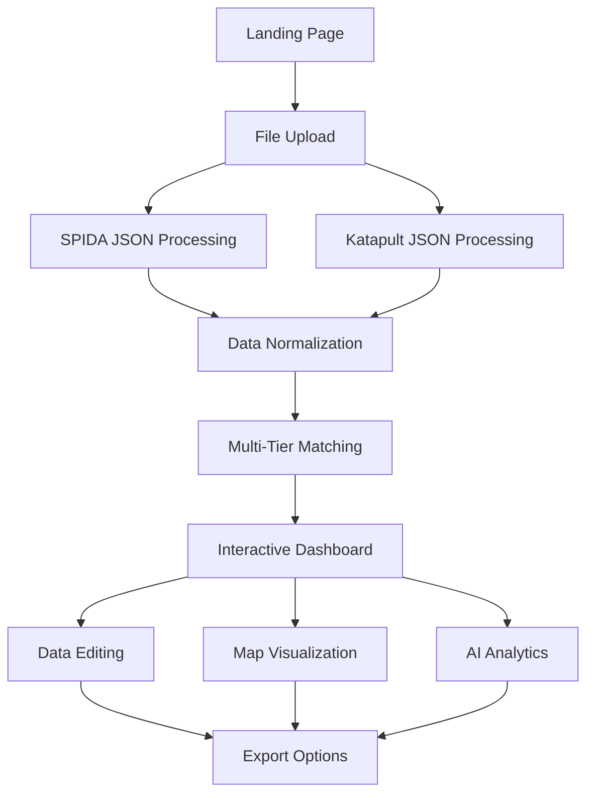

# QuiC - Quick Comparison Tool for Utility Pole Data

[](https://reactjs.org/)
[](https://www.typescriptlang.org/)
[](https://ai.google.dev/)
[](https://www.netlify.com/)

> **QuiC** is a sophisticated web application designed for utility companies and engineers to compare, analyze, and reconcile pole data between **SPIDA** (Structural Pole Inspection and Design Analysis) and **Katapult** systems. The application provides intelligent matching algorithms, interactive visualizations, and AI-powered analytics to streamline utility pole data management workflows.


## 🎯 **Project Purpose**

QuiC addresses the critical need for accurate pole data reconciliation in utility management by:

- **Automating Data Comparison**: Eliminates manual comparison of pole specifications, coordinates, and load capacities
- **Intelligent Matching**: Uses multi-tier matching algorithms to identify corresponding poles across systems
- **Data Quality Assurance**: Highlights discrepancies and provides tools for correction
- **Workflow Optimization**: Streamlines the process from data import to final export with reconciled information
- **Decision Support**: Generates AI-powered reports for technical teams and executives

## ✨ **Key Features**

### 📊 **Multi-Tier Data Matching**
- **Tier 1**: SCID (Structure Component ID) exact matching
- **Tier 2**: Pole number matching with intelligent normalization
- **Tier 3**: Coordinate-based matching with configurable distance thresholds
- **Tier 4**: Specification-verified coordinate matching for enhanced accuracy

### 🗺️ **Interactive Geospatial Visualization**
- **Dynamic Leaflet Maps**: Real-time visualization of pole locations
- **Color-Coded Markers**: Visual representation of match tiers and data quality
- **Click-to-Inspect**: Detailed pole information accessible through map interaction
- **Geographic Distribution Analysis**: Spatial analysis of matched and unmatched poles

### 📈 **Advanced Analytics Dashboard**
- **Real-time Statistics**: Live comparison metrics and success rates
- **Mismatch Detection**: Automatic identification of specification, capacity, and configuration discrepancies
- **Progress Tracking**: Visual indicators for data loading and processing status
- **Quality Metrics**: Comprehensive reporting on data integrity and matching confidence

### 🤖 **AI-Powered Reporting**
Powered by **Google Gemini AI**, QuiC generates three types of intelligent reports:

#### **Executive Summary Reports**
- High-level project overview and key findings
- Business impact analysis and recommendations
- Risk assessment and mitigation strategies
- Cost-benefit analysis of pole replacements/upgrades

#### **Technical Analysis Reports**
- Detailed engineering specifications comparison
- Load capacity analysis and safety margins
- Structural integrity assessments
- Technical recommendations for field teams

#### **Field Operations Reports**
- Actionable work orders and prioritized tasks
- Geographic routing optimization for field crews
- Material requirements and resource planning
- Safety considerations and compliance notes

### 📋 **Comprehensive Data Management**

#### **Input Processing**
- **SPIDA JSON Import**: Full support for SPIDA project structures and design specifications
- **Katapult JSON Import**: Intelligent parsing of Katapult node networks and birthmark data
- **Flexible Data Sources**: Handles multiple SPIDA structure types (project.structures, leads.locations)
- **Validation & Error Handling**: Robust input validation with clear error messaging

#### **Data Normalization**
- **Coordinate Standardization**: Converts various geographic coordinate formats
- **Specification Parsing**: Intelligent extraction of pole height, class, and species
- **Pole Number Cleaning**: Advanced regex-based pole number normalization
- **Capacity Calculation**: Percentage-based load capacity analysis

#### **Export Capabilities**
- **CSV Export**: Tabular data for spreadsheet analysis
- **SPIDA JSON Export**: Updated SPIDA files with reconciled data
- **Katapult Attribute Updates**: Excel format for Katapult system imports
- **AI Report Downloads**: Generated analysis reports in multiple formats

### 🛠️ **Interactive Data Editing**
- **In-table Editing**: Real-time modification of pole specifications
- **Mismatch Resolution**: Tools for resolving identified discrepancies
- **Change Tracking**: Visual indicators for modified data
- **Bulk Operations**: Efficient handling of multiple pole updates

## 🏗️ **Technical Architecture**

### **Technology Stack**

#### **Frontend Framework**
- **React 18.2**: Component-based UI with hooks and functional components
- **TypeScript 5.2**: Type-safe development with comprehensive interfaces
- **Vite 5.0**: Lightning-fast build tool and development server
- **Tailwind CSS 3.3**: Utility-first CSS framework for responsive design

#### **Mapping & Visualization**
- **Leaflet 1.9.4**: Open-source mapping library
- **React-Leaflet 4.2.1**: React integration for Leaflet maps
- **Custom Overlays**: Pole markers, connection lines, and interactive popups

#### **Data Processing**
- **Custom Algorithms**: Multi-tier matching with configurable thresholds
- **Haversine Distance**: Accurate geographic distance calculations
- **JSON Processing**: Robust parsing and validation of complex data structures
- **Excel Export**: XLSX format generation for Katapult updates

#### **AI Integration**
- **Google Gemini AI**: Advanced language model for report generation
- **Contextual Analysis**: AI understands utility industry terminology and standards
- **Custom Prompts**: Tailored AI instructions for different report types

#### **Cloud & Deployment**
- **Netlify**: Serverless deployment with edge optimization
- **Neon Database**: PostgreSQL-compatible serverless database
- **Environment Variables**: Secure API key and configuration management

### **Application Flow**



### **Data Processing Pipeline**

#### **1. Input Validation & Parsing**
```typescript
// SPIDA Data Processing
interface SpidaJsonFullFormat {
  project?: { structures?: SpidaProjectStructure[] };
  spidadevices?: { structures?: SpidaProjectStructure[] };
  clientData?: { poles?: SpidaPoleTypeDefinition[] };
  leads?: Array<{ locations: SpidaLocation[] }>;
}

// Katapult Data Processing
interface KatapultJsonFormat {
  nodes?: Record<string, KatapultJsonNode>;
  connections?: Record<string, any>;
}
```

#### **2. Normalization Process**
- **Coordinate Extraction**: Multiple fallback strategies for geographic data
- **Pole Specification Building**: Intelligent parsing of height, class, and species
- **Load Capacity Analysis**: Percentage extraction from SPIDA analysis results
- **Communication Drop Detection**: Complex logic for service connection identification

#### **3. Matching Algorithm**
```typescript
enum MatchTier {
  SCID_EXACT_MATCH = 'SCID Exact Match',
  POLE_NUMBER_MATCH = 'Pole Number Match',
  COORDINATE_DIRECT_MATCH = 'Coordinate Direct Match (<1m)',
  COORDINATE_SPEC_VERIFIED = 'Coordinate + Specification Verified',
  UNMATCHED_SPIDA = 'Unmatched SPIDA',
  UNMATCHED_KATAPULT = 'Katapult-Only'
}
```

#### **4. Quality Assessment**
- **Specification Mismatches**: Height, class, and species discrepancies
- **Capacity Variations**: Load percentage differences
- **Coordinate Accuracy**: Geographic positioning validation
- **Communication Services**: Drop connection status comparison

## 🚀 **Getting Started**

### **Prerequisites**
- **Node.js**: Version 18.0 or higher
- **npm**: Version 8.0 or higher
- **Modern Browser**: Chrome, Firefox, Safari, or Edge with ES2020 support

### **Installation**

1. **Clone the Repository**
   ```bash
   git clone https://github.com/your-org/quic-v3.git
   cd quic-v3
   ```

2. **Install Dependencies**
   ```bash
   npm install
   ```

3. **Environment Configuration**
   ```bash
   cp env.example .env
   ```
   
   Configure your environment variables:
   ```env
   VITE_GEMINI_API_KEY=your_google_gemini_api_key
   VITE_NETLIFY_DATABASE_URL=your_neon_database_url
   VITE_ENCRYPTION_KEY=your_encryption_key
   ```

4. **Development Server**
   ```bash
   npm run dev
   ```
   
   Application will be available at `http://localhost:5173`

5. **Production Build**
   ```bash
   npm run build
   npm run preview
   ```

### **Quick Start Guide**

#### **Step 1: Data Upload**
1. Navigate to the QuiC application
2. Click "Upload SPIDA JSON" and select your SPIDA project file
3. Click "Upload Katapult JSON" and select your Katapult export file
4. Wait for data processing and validation

#### **Step 2: Run Comparison**
1. Click "Run Comparison" once both files are loaded
2. Review the statistics dashboard for match rates and quality metrics
3. Examine the data table for detailed pole-by-pole comparison

#### **Step 3: Data Review & Editing**
1. Use the interactive map to visualize pole locations
2. Click on table rows to view detailed pole information
3. Edit SPIDA specifications directly in the table
4. Resolve mismatches highlighted in red

#### **Step 4: Export Results**
1. **CSV Export**: Download comparison results for spreadsheet analysis
2. **SPIDA JSON**: Save updated SPIDA file with reconciled data
3. **Katapult Attributes**: Generate Excel file for Katapult system import
4. **AI Reports**: Generate executive, technical, or field operation reports

## 📊 **Data Formats & Standards**

### **SPIDA JSON Structure**
QuiC supports multiple SPIDA data organization patterns:

```json
{
  "project": {
    "structures": [
      {
        "id": "001",
        "label": "PL-12345",
        "geographicCoordinate": {
          "coordinates": [-120.1234, 47.5678]
        },
        "recommendedDesign": {
          "pole": {
            "species": "DOUGLAS_FIR",
            "class": "2",
            "length": {"value": 40, "unit": "FOOT"}
          }
        }
      }
    ]
  }
}
```

### **Katapult JSON Structure**
```json
{
  "nodes": {
    "node_001": {
      "node_type": "pole",
      "geometry": {
        "type": "Point",
        "coordinates": [-120.1234, 47.5678]
      },
      "attributes": {
        "scid": {"Imported": "001"},
        "PL_number": {"Imported": "12345"},
        "pole_spec": "40-2 DOUGLAS FIR"
      }
    }
  }
}
```

### **Matching Criteria**

| Tier | Criteria | Threshold | Confidence |
|------|----------|-----------|------------|
| 1 | SCID Exact Match | Exact string match | 100% |
| 2 | Pole Number Match | Normalized alphanumeric | 95% |
| 3 | Coordinate Direct | < 1 meter distance | 90% |
| 4 | Coordinate + Spec | < 5 meters + spec match | 85% |

## 🎨 **User Interface Components**

### **Dashboard Layout**
- **Responsive Design**: Optimized for desktop and mobile workflows
- **Progressive Enhancement**: Functional without JavaScript for core features
- **Accessibility**: WCAG 2.1 AA compliant with keyboard navigation
- **Dark Theme**: Professional dark interface optimized for long work sessions

### **Interactive Data Table**
- **Sortable Columns**: Click column headers to sort data
- **Inline Editing**: Double-click cells to modify SPIDA specifications
- **Mismatch Highlighting**: Visual indicators for data discrepancies
- **Pagination**: Efficient handling of large datasets
- **Export Selection**: Export filtered or selected data subsets

### **Geospatial Map**
- **Multiple Base Layers**: OpenStreetMap, satellite imagery options
- **Marker Clustering**: Automatic grouping for dense pole distributions
- **Popup Information**: Detailed pole data accessible via map clicks
- **Layer Controls**: Toggle between SPIDA, Katapult, and matched pole views

## 🔧 **Configuration & Customization**

### **Matching Parameters**
Customize matching behavior in `constants.ts`:

```typescript
export const COORDINATE_MATCH_THRESHOLD_METERS = {
  DIRECT: 1,        // Direct coordinate match threshold
  VERIFIED_SPEC: 5  // Coordinate + specification verification threshold
};

export const POLE_SPEC_HEIGHT_TOLERANCE_FEET = 1; // Height matching tolerance
```

### **Supported Katapult Node Types**
```typescript
export const ALLOWED_KATAPULT_NODE_TYPES = new Set([
  "pole",
  "power",
  "power transformer",
  "joint",
  "joint transformer"
]);
```

## 📈 **Analytics & Reporting**

### **Real-time Metrics**
- **Match Success Rate**: Percentage of successfully matched poles
- **Data Quality Score**: Overall assessment of input data completeness
- **Processing Speed**: Performance metrics for large datasets
- **Geographic Coverage**: Spatial distribution analysis

### **AI-Powered Insights**
QuiC's AI analytics provide:

#### **Pattern Recognition**
- Identification of systematic specification differences
- Geographic clustering of mismatches
- Load capacity trend analysis
- Communication service distribution patterns

#### **Predictive Analysis**
- Pole replacement prioritization based on condition and load
- Resource allocation recommendations
- Timeline estimation for field operations
- Cost analysis for infrastructure upgrades

#### **Risk Assessment**
- Safety margin analysis for overloaded poles
- Geographic risk mapping for extreme weather resilience
- Compliance assessment against utility standards
- Emergency response preparation recommendations

## 🧪 **Testing & Quality Assurance**

### **Data Validation**
- **Schema Validation**: JSON structure verification against expected formats
- **Coordinate Validation**: Geographic bounds checking and projection validation
- **Specification Parsing**: Robust handling of various pole specification formats
- **Edge Case Handling**: Graceful degradation for incomplete or malformed data

### **Performance Testing**
- **Large Dataset Handling**: Tested with 10,000+ pole datasets
- **Memory Management**: Efficient processing to prevent browser crashes
- **Rendering Performance**: Optimized table and map rendering for smooth interaction

## 🔐 **Security & Privacy**

### **Data Protection**
- **Client-Side Processing**: All pole data processed locally in the browser
- **No Data Storage**: Files are not uploaded to external servers
- **Encryption**: Sensitive API keys encrypted in environment variables
- **Access Controls**: Role-based access for enterprise deployments

### **API Security**
- **Rate Limiting**: Google Gemini API calls are throttled and monitored
- **Key Rotation**: Support for regular API key updates
- **Error Handling**: Secure error messages that don't expose sensitive information

## 📁 **Project Structure**

```
quic-v3/
├── components/              # React UI components
│   ├── DashboardLayout.tsx  # Main application layout
│   ├── DataTable.tsx        # Interactive comparison table
│   ├── FileLoader.tsx       # File upload components
│   ├── InteractiveMap.tsx   # Leaflet map integration
│   ├── AIAnalytics.tsx      # AI-powered analytics dashboard
│   ├── StatusDisplay.tsx    # Progress and statistics display
│   └── ...
├── services/                # Core business logic
│   ├── dataProcessingService.ts  # Data normalization and matching
│   ├── exportService.ts     # File export functionality
│   └── geminiService.ts     # AI integration service
├── hooks/                   # Custom React hooks
├── utils/                   # Utility functions
├── types.ts                 # TypeScript type definitions
├── constants.ts             # Application configuration
├── netlify/
│   └── functions/           # Serverless functions
└── public/                  # Static assets
```

## 🤝 **Contributing**

### **Development Workflow**
1. **Fork** the repository
2. **Create** a feature branch (`git checkout -b feature/amazing-feature`)
3. **Commit** your changes (`git commit -m 'Add some amazing feature'`)
4. **Push** to the branch (`git push origin feature/amazing-feature`)
5. **Open** a Pull Request

### **Code Standards**
- **TypeScript**: Strict mode enabled with comprehensive type checking
- **ESLint**: Configured for React and TypeScript best practices
- **Prettier**: Automatic code formatting on save
- **Component Architecture**: Functional components with hooks preferred

### **Testing Guidelines**
- **Unit Tests**: Required for new utility functions
- **Integration Tests**: Required for data processing pipelines
- **Manual Testing**: Cross-browser compatibility verification
- **Performance Testing**: Large dataset validation

## 📄 **License**

This project is licensed under the MIT License - see the [LICENSE.md](LICENSE.md) file for details.

## 🙏 **Acknowledgments**

- **SPIDA**: For providing comprehensive pole analysis standards
- **Katapult**: For utility network modeling capabilities
- **Google Gemini AI**: For powering intelligent report generation
- **OpenStreetMap**: For global geographic data
- **React Community**: For exceptional framework and ecosystem support

## 📞 **Support & Contact**

### **Technical Support**
- **Documentation**: [Wiki](../../wiki) for detailed technical guides
- **Issues**: [GitHub Issues](../../issues) for bug reports and feature requests
- **Discussions**: [GitHub Discussions](../../discussions) for community support

### **Enterprise Support**
For enterprise deployments, custom integrations, or professional services:
- **Email**: support@quic-utility.com
- **Documentation**: Enterprise deployment guides available
- **Training**: Custom training programs for utility teams

---

**QuiC v3.0** - Revolutionizing utility pole data management through intelligent automation and AI-powered analytics.

*Built with ❤️ for the utility industry*
